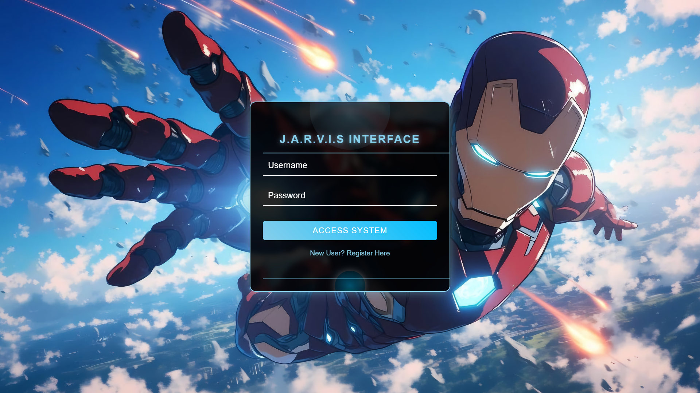

# **Anime-Themed Login Pages** 🎌  

A collection of **6 unique login pages** with different CSS styles and interactive features, inspired by popular anime themes. Built with pure HTML, CSS, and JavaScript.  

---

## **Features** ✨  
- **6 Distinct Designs**: Each login page has a unique anime-inspired theme.  
- **Responsive**: Works on desktop.  
- **Interactive Elements**:  
  - Hover effects
  - Transitions
  - Animations
  - and more.
- **Lightweight**: No frameworks—just vanilla JS and CSS.  

---

## **Pages & Themes** 🖥️  
| # | Theme | Inspiration | Key Feature |  
|---|-------|-------------------|-------------|  
| 1 | Music Music | *Pokemon* | Unique Retro Styling |  
| 2 | Travels Japan | *Japan* | Image Slide Show |  
| 3 | Naruto Login | *Naruto Shippuden* | Animation effects |  
| 4 | Luffy Login | *One Piece* | Animated Login Container |  
| 5 | Zoro Login | *One Piece* | Switch Between Login-Signup Page |  
| 6 | Jarvis Interface | *Iron-Man* | Animated Page switch and sound effects |  

---

## **How to Run** 🚀  
1. **Clone the repo**:  
   ```bash  
   git clone https://github.com/theycallmecode/Login-Pages.git 
   ```  
2. Open any `index.html` file in your browser.

---

## **Tech Stack** 💻  
- **Frontend**: HTML5, CSS3, JavaScript  
- **Tools**: VS Code, Git  

---

## **Screenshots** 📸  
| Theme | Preview |  
|-------|---------|  
| Music Gengar |  |  
| Travels Japan |  |  
| Naruto Login |  |
| Luffy Login |  |
| Zoro Login |  |
| Jarvis Interface |  |

---

## **What I Learned** 📚  
- Advanced CSS animations (`@keyframes`, `transform`).  
- DOM manipulation with vanilla JS (e.g., form validation).  
- Theming with CSS variables (`:root`).  

---

## **License** ⚖️  
MIT License. Free to use and modify!  

---

## **Connect with Me** 🌟  
- GitHub: [@theycallmecode](https://github.com/theycallmecode)  
- Linkedin: [Shubham Raj](www.linkedin.com/in/shubham-raj-1a11aa332)  

---